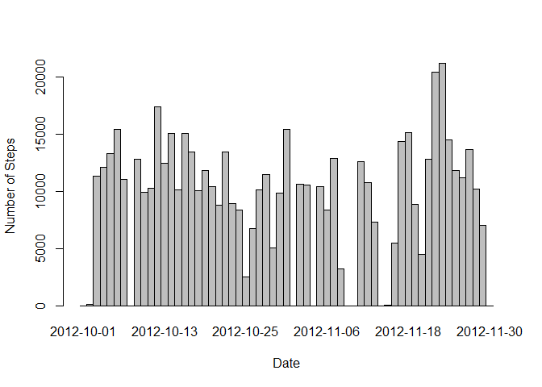
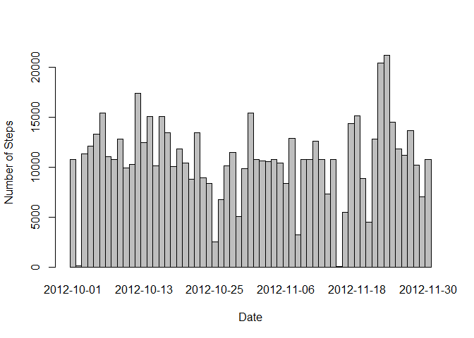
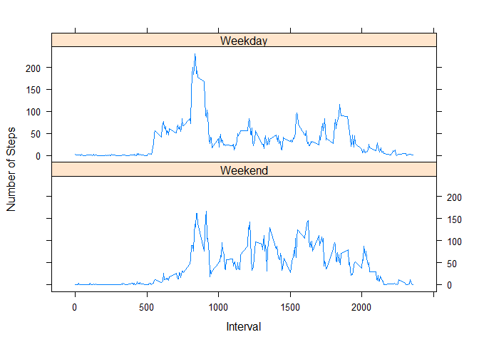

# Reproducible Research: Peer Assessment 1
Seah Kah Tat


## Loading and preprocessing the data

First, the data for this assignment can be downloaded and extracted from the .zip file to the working directory using the following code:


```r
# download zip file
fileUrl <- "https://d396qusza40orc.cloudfront.net/repdata%2Fdata%2Factivity.zip"
dest <- paste(getwd(), "/repdata-data-activity.zip", sep = "")
if(!file.exists(dest)) download.file(fileUrl, dest)

# unzip the file
filename <- paste(getwd(), "/activity.csv", sep = "")
if(!file.exists(filename)) unzip(dest)
```

The data can then be read and preprocessed with the following code:


```r
# create a data frame containing total number of steps for each day
data <- read.csv("activity.csv")
daily_steps <- aggregate(data$steps, list(data$date), function(x) sum(x,na.rm = TRUE))
colnames(daily_steps) <- c("date_unformat", "steps")
daily_steps$date <- as.Date(daily_steps$date_unformat, "%Y-%m-%d")

# create a data frame containing total number of steps for each interval
int_steps <- aggregate(data$steps, list(data$interval), function (x) mean(x,na.rm = TRUE))
colnames(int_steps) <- c("interval", "steps")
```

## What is mean total number of steps taken per day?

The following is a histrogram of the total number of steps taken for each day:


```r
barplot(daily_steps$steps, names.arg = daily_steps$date, space = 0, xlab = "Date", ylab = "Number of Steps")
```

 

Mean total number of steps:


```r
mean(daily_steps$steps)
```

```
## [1] 9354.23
```

Median total number of steps:


```r
median(daily_steps$steps)
```

```
## [1] 10395
```

## What is the average daily activity pattern?

The following is a time series plot of the average number of steps taken across all days at each 5-minute interval:


```r
plot(int_steps$interval, int_steps$steps, type = "l", xlab = "Interval", ylab = "Number of Steps")
```

 

Interval that contains the maximum number of steps:

```r
int_steps[which.max(int_steps$steps),"interval"]
```

```
## [1] 835
```

## Imputing missing values

Total number of missing values in the dataset:


```r
completed <- complete.cases(data)
sum(!completed)
```

```
## [1] 2304
```

My general strategy for filling the missing values is to replace them with the mean number of steps at the respective 5-minute interval. This can be executed with the following code to generate a new dataset with the missing values filled up:


```r
filled_data <- data
for(i in 1:nrow(filled_data)) 
    if(is.na(filled_data[i,"steps"]))
        filled_data[i,"steps"] <- int_steps[which(int_steps$interval == filled_data[i, "interval"]), "steps"]

# create a data frame containing total number of steps for each day from new dataset
new_daily_steps <- aggregate(filled_data$steps, list(filled_data$date), mean)
colnames(new_daily_steps) <- c("date_unformat", "steps")
new_daily_steps$date <- as.Date(new_daily_steps$date_unformat, "%Y-%m-%d")
```

The corresponding histogram for this new dataset is shown below:


```r
barplot(new_daily_steps$steps, names.arg = new_daily_steps$date, space = 0, xlab = "Date", ylab = "Number of Steps")
```

 

In this case, the mean total number of steps is


```r
mean(new_daily_steps$steps)
```

```
## [1] 37.3826
```

which is more than the mean calculated from the origina dataset. The median total number of steps is now


```r
median(new_daily_steps$steps)
```

```
## [1] 37.3826
```

which is higher than that from the previous dataset. This shows that imputing missing data results in a higher estimate on the total daily number of steps.

## Are there differences in activity patterns between weekdays and weekends?

To plot the activity pattern for weekdays and weekends respectively, first preprocess the dataset with the filled-in missing values as follow:


```r
filled_data$day <- weekdays(as.Date(filled_data$date, "%Y-%m-%d"))
filled_data$day <- factor(as.character(filled_data$day), labels = c("Weekday","Weekday","Weekend","Weekend","Weekday","Weekday","Weekday"))

# create a data frame containing total number of steps for each interval:
# 1. for weekdays
int_steps_wkday <- aggregate(filled_data[filled_data$day == "Weekday", ]$steps, list(filled_data[filled_data$day == "Weekday", ]$interval), mean)
# 2. for weekends
int_steps_wkend <- aggregate(filled_data[filled_data$day == "Weekend", ]$steps, list(filled_data[filled_data$day == "Weekend", ]$interval), mean)

# Combine both data frames and factor the data using "weekday" or "weekend"
int_steps_wkday$day <- 1
int_steps_wkend$day <- 2
plotdata <- rbind(int_steps_wkday, int_steps_wkend)
colnames(plotdata) <- c("interval", "steps", "day")
plotdata$day <- factor(plotdata$day, labels = c("Weekday", "Weekend"))
```

Then with the processed data frame, plot the data using the lattice plotting system as follow: 


```r
library(lattice)
xyplot(steps~interval | factor(day), data = plotdata, type = "l", layout = matrix(c(1, 2), 2, 1, byrow = TRUE), as.table = TRUE, xlab = "Interval", ylab = "Number of Steps")
```

 

The resulting plot serves as a basis for comparing the activity patterns between weekdays and weekends.
